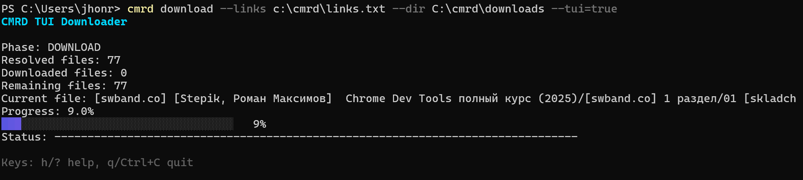

# CMRD

Cloud.Mail public link downloader rewritten from PHP to idiomatic Go with CLI, TUI (Bubble Tea), gRPC API and library mode.

Загрузчик публичных ссылок Cloud.Mail, переписанный с PHP на идиоматичный Go, с режимами CLI, TUI (Bubble Tea), gRPC API и библиотечным использованием.

gRPC mode is currently not fully tested in production scenarios.
Режим gRPC пока не полностью протестирован в production-сценариях.

# Cloud&#64;Mail.Ru Downloader

Cкачивание из облака [Mail.Ru](http://cloud.mail.ru/) по публичной ссылки. Авторизация в Mail.Ru не требуется.

- Приложение компилировалось под Windows, но должно по идее работать на всех платформах.
- За идею и основу взято [Cloud Mail.Ru Downloader](https://github.com/Geograph-us/Cloud-Mail.Ru-Downloader/).
- Скрипт умеет корректно обрабатывать папки в облаке любой вложенности.
- Поддерживается докачка файлов.
- Можно легко докрутить GUI...

## Documentation / Документация
- Releases: `https://github.com/jhonroun/cmrd/releases`
- English docs: `doc/en/README.md`
- Русская документация: `doc/ru/README.md`
- English CLI: `doc/en/CLI.md`
- Русский CLI: `doc/ru/CLI.md`
- English gRPC: `doc/en/GRPC.md`
- Русский gRPC: `doc/ru/GRPC.md`

## Install
### Linux (wget + chmod + mv to sbin)
1. Download binary (choose amd64 or arm64):
   - `wget -O cmrd https://github.com/jhonroun/cmrd/releases/latest/download/cmrd-linux-amd64`
2. Make executable:
   - `chmod +x cmrd`
3. Move to `/usr/sbin`:
   - `sudo mv cmrd /usr/sbin/cmrd`
4. Run from anywhere:
   - `cmrd --help`

### Windows (via eget)
1. Install `eget`:
   - `winget install zyedidia.eget`
2. Create user bin directory:
   - `mkdir "%USERPROFILE%\\bin"`
3. Download CMRD as `cmrd.exe` to user bin:
   - `eget jhonroun/cmrd --asset "cmrd-windows-amd64.exe" --to "%USERPROFILE%\\bin\\cmrd.exe"`
   - ARM64: `eget jhonroun/cmrd --asset "cmrd-windows-arm64.exe" --to "%USERPROFILE%\\bin\\cmrd.exe"`
4. Add user bin to PATH (once):
   - `setx PATH "%PATH%;%USERPROFILE%\\bin"`
5. Restart terminal and verify:
   - `cmrd --help`

## Установка (RU)
### Linux (wget + chmod + mv в sbin)
1. Скачайте бинарник (amd64 или arm64):
   - `wget -O cmrd https://github.com/jhonroun/cmrd/releases/latest/download/cmrd-linux-amd64`
2. Сделайте файл исполняемым:
   - `chmod +x cmrd`
3. Переместите в `/usr/sbin`:
   - `sudo mv cmrd /usr/sbin/cmrd`
4. Проверьте запуск:
   - `cmrd --help`

### Windows (через eget)
1. Установите `eget`:
   - `winget install zyedidia.eget`
2. Создайте пользовательский каталог:
   - `mkdir "%USERPROFILE%\bin"`
3. Скачайте CMRD как `cmrd.exe`:
   - `eget jhonroun/cmrd --asset "cmrd-windows-amd64.exe" --to "%USERPROFILE%\bin\cmrd.exe"`
   - ARM64: `eget jhonroun/cmrd --asset "cmrd-windows-arm64.exe" --to "%USERPROFILE%\bin\cmrd.exe"`
4. Добавьте каталог в `PATH` (один раз):
   - `setx PATH "%PATH%;%USERPROFILE%\bin"`
5. Перезапустите терминал и проверьте:
   - `cmrd --help`

## English Summary
CMRD resolves Cloud.Mail public links into direct file URLs, prepares aria2c input, and runs multi-file downloads with resumable behavior.

## Aria2c

`aria2c.exe` can be find at reference cataloge.

### Quick Start (EN)
1. Build CLI:
   - `go build -o cmrd ./cmd/cmrd`
2. Set aria2c path (optional, if aria2c is not in PATH):
   - Linux/macOS: `export CMRD_ARIA2C_PATH=/usr/bin/aria2c`
   - Windows PowerShell: `$env:CMRD_ARIA2C_PATH="C:\tools\aria2c.exe"`
3. Create `links.txt` with one Cloud.Mail public link per line.
4. Run:
   - `./cmrd download --links links.txt --dir downloads --tui=true`

### First Run (EN)
1. Start with resolve-only mode:
   - `./cmrd resolve --links links.txt`
2. Verify resolved paths.
3. Start download:
   - `./cmrd download --links links.txt --dir downloads`
4. Optional: start gRPC API for external UI (experimental, not fully tested):
   - `./cmrd serve-grpc --listen :50051`

## Краткое описание на русском
CMRD преобразует публичные ссылки Cloud.Mail в прямые URL файлов, формирует вход для aria2c и запускает многопоточную загрузку с поддержкой докачки.

## Aria2c

`aria2c.exe` в каталоге refence

### Quick Start (RU)
1. Соберите CLI:
   - `go build -o cmrd ./cmd/cmrd`
2. Укажите путь к aria2c (опционально, если нет в PATH):
   - Linux/macOS: `export CMRD_ARIA2C_PATH=/usr/bin/aria2c`
   - Windows PowerShell: `$env:CMRD_ARIA2C_PATH="C:\tools\aria2c.exe"`
3. Создайте `links.txt` (по одной публичной ссылке Cloud.Mail в строке).
4. Запустите:
   - `./cmrd download --links links.txt --dir downloads --tui=true`

### First Run (RU)
1. Сначала проверьте резолв ссылок:
   - `./cmrd resolve --links links.txt`
2. Проверьте сформированные пути файлов.
3. Запустите скачивание:
   - `./cmrd download --links links.txt --dir downloads`
4. Опционально поднимите gRPC API для внешнего UI (экспериментально, не полностью протестировано):
   - `./cmrd serve-grpc --listen :50051`

## Next Steps
- WEB-UI for browser-based control and monitoring.
- Standalone GUI client for desktop usage.
